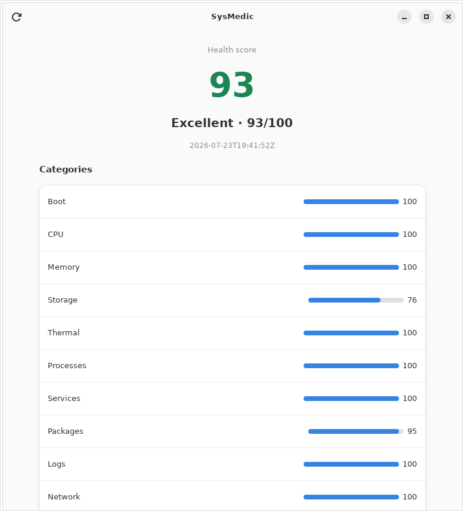
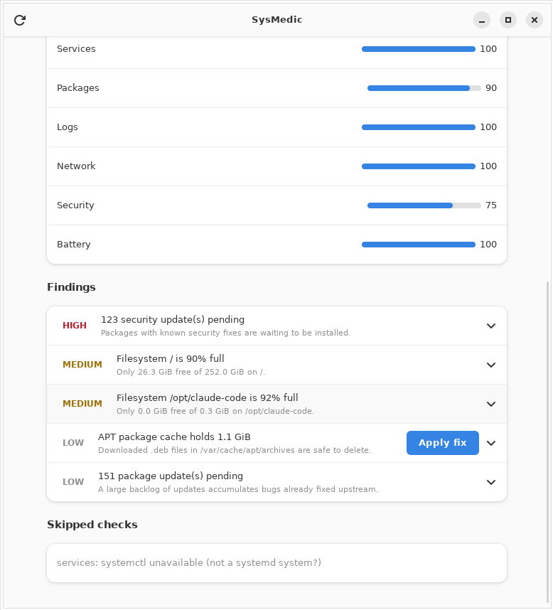
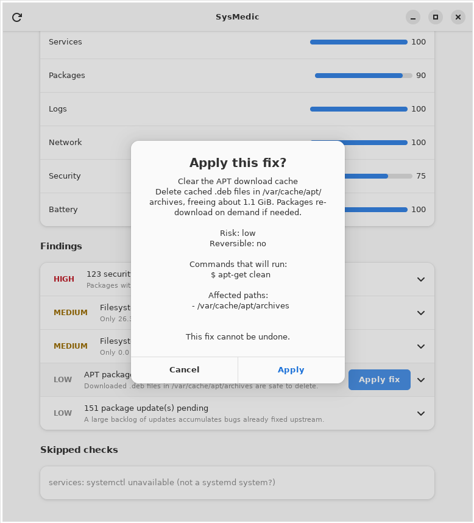
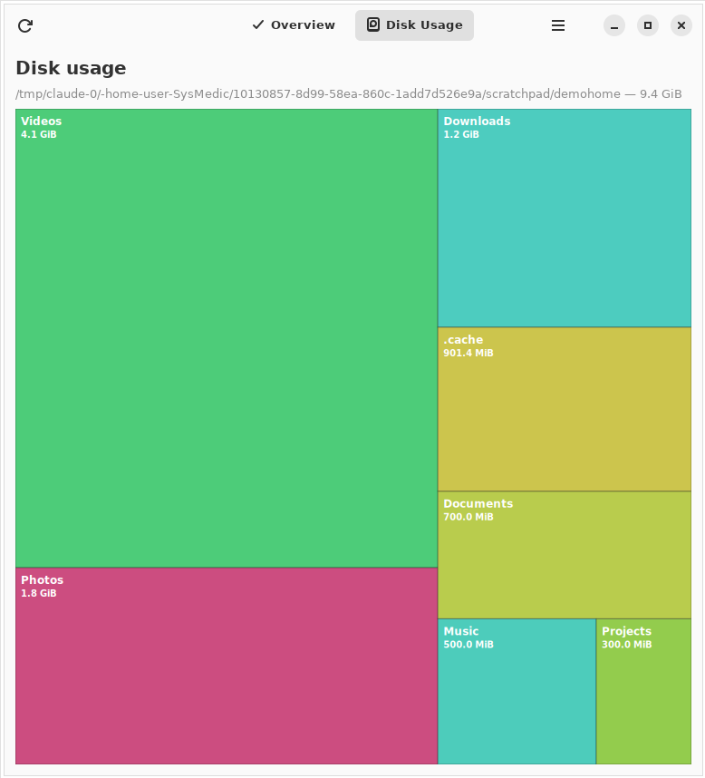

# SysMedic 🩺

**A doctor for your Linux system** — it examines, diagnoses, explains in plain
language, prescribes safe fixes, and follows up. Not another cleaner, not
another monitor: the app you install first on a fresh Ubuntu.

## Screenshots

| Dashboard | Findings & one-click fix |
|---|---|
|  |  |

| Safe-fix confirmation | Disk Usage treemap |
|---|---|
|  |  |

The confirmation dialog is the heart of the *prescribe* step: before anything
changes you see exactly what will run, which paths it touches, its risk, and
whether it can be undone. The Disk Usage page renders a squarified treemap of
the folders eating your space. *(Also available in Arabic / RTL.)*

```
  Health score: 97/100  (Excellent)

  Storage    ███████░░░  76
  Security   ██████████ 100
  ...

  [MEDIUM] Filesystem / is 88% full
      Only 29.6 GiB free of 252.0 GiB on /.
      Remedy: Clean the APT cache, vacuum the journal, remove old snaps...
      Try: sudo apt clean && sudo journalctl --vacuum-size=200M
```

## Why SysMedic?

Every existing tool is a monitor (htop, btop, Mission Center), a cleaner
(BleachBit, Stacer) or an expert CLI (systemd-analyze, smartctl, journalctl).
**Nobody diagnoses, explains and fixes safely.** SysMedic does all five steps
of a doctor's visit:

| Step | What you get |
|---|---|
| **Checkup** | One command scans CPU, RAM, swap, disks, thermal, battery, services, processes, boot, logs, packages, network and security → a 0–100 health score |
| **Diagnose** | 21+ rules: slow boot, full disks, zombie processes, overheating, failed services, broken/old packages, huge logs, snap bloat, DNS issues, SSH root login, inactive firewall... |
| **Explain** | Every finding answers, offline and in English + العربية: what caused it? is it dangerous? what's the impact? how do I fix it? what if I ignore it? |
| **Prescribe** | One-click safe fixes with a mandatory preview (what runs, which files change, is it reversible) and undo, authorized via polkit — the app never runs as root |
| **Follow-up** | Scheduled checkups, proactive notifications and a health-score trend |

## The desktop app (M2)

A GNOME-native GTK4/libadwaita application — automatic dark/light, Arabic and
English, checkup on a background thread:

```bash
sudo apt install libgtk-4-dev libadwaita-1-dev   # build deps
cargo run --release -p sysmedic-gui
```

The dashboard shows the health score and per-category bars; each finding
expands into the five doctor questions (cause / dangerous? / impact / remedy /
risk if ignored) with evidence and a suggested command.

## Try the CLI (M1)

```bash
cargo run --release -p sysmedic-cli -- checkup            # colored report
sysmedic checkup --format json                            # machine-readable
sysmedic checkup --format html --output report.html       # shareable report
sysmedic explain storage.disk_nearly_full --lang ar       # explain any finding
sysmedic checks                                           # list all rules
sysmedic disk ~                                           # largest folders
sysmedic network                                          # route, DNS, ports
```

Requires Rust stable; runs on any modern Linux (Ubuntu/Debian gets the fullest
coverage). Anything unavailable — no battery, no systemd in a container — is
skipped gracefully and reported as a skipped check.

## Advanced tools (M4)

- **Disk analyzer** — a size tree with a squarified treemap in the GUI and a
  bar breakdown on the CLI (`sysmedic disk [path]`).
- **Disk health** — SMART self-assessment, reallocated sectors and SSD wear
  become explained findings.
- **Security audit** — services listening beyond localhost, SSH password logins
  and root login, inactive firewall and pending security updates, all with
  remedies.
- **Network** — `sysmedic network` shows the default route, DNS, listening
  ports (localhost vs network-exposed) and latency.

## Safe fixes (M3)

SysMedic can *prescribe* and apply fixes — always with informed consent, never
as root:

```bash
sysmedic fix                                # list fixes that apply right now
sysmedic fix fix.apt_clean --dry-run        # preview: commands, files, undo
sysmedic fix fix.apt_clean --yes            # apply (root: direct; else pkexec)
sysmedic undo --yes                         # revert the last reversible fix
```

Before anything changes you see exactly what will run, which paths it touches,
its risk, and whether it can be undone. The GUI and CLI never run as root: the
privileged step goes through `sysmedic-fix-helper`, launched via **pkexec** and
authorized by **polkit**. The helper accepts a fix *id* only and rebuilds the
plan itself, so no command can be injected. Every applied fix is recorded in a
transaction journal (`/var/lib/sysmedic/journal.json`) that powers `undo`.
Current fixes: clear APT cache, trim the journal, remove old kernels, reduce
retained snap revisions, remove unused Flatpak runtimes, enable the firewall.

## Follow-up: schedule, alerts, history, PDF (M5)

SysMedic keeps watching after the first checkup:

```bash
sysmedic schedule daily          # run a checkup automatically (systemd user timer)
sysmedic monitor                 # checkup + record history + notify on alerts
sysmedic history                 # health-score trend (sparkline + last runs)
sysmedic checkup --format pdf --output report.pdf   # shareable PDF report
sysmedic schedule off            # stop scheduled checkups
```

Scheduling uses a **systemd user timer** (Linux-native — survives reboots, no
idle cost) rather than an always-on daemon. Each scheduled run fires desktop
notifications for disk-full, overheating, low-RAM and pending-security-update
alerts, and appends to a health-score history the GUI shows as a trend strip.
PDF export prints the HTML report through a headless browser, falling back to
HTML when none is installed.

## Install & 1.0 (M6)

Grab a `.deb` from [Releases](https://github.com/abosalehg-ui/SysMedic/releases)
(`sudo apt install ./sysmedic_*.deb`) or build from source — see
[INSTALL.md](INSTALL.md). Flatpak, AppImage and Snap manifests live in
[`packaging/`](packaging/README.md).

**Optional AI deep-explain** — the offline explanations always work with no
network. If you want deeper, machine-specific answers you can bring your own
Claude API key; it is strictly opt-in and sends only the finding id + evidence:

```bash
export ANTHROPIC_API_KEY=sk-ant-...
sysmedic explain storage.disk_nearly_full --deep
```

## Project

- **Stack:** Rust workspace; GNOME-native GTK4/libadwaita GUI (dark/light).
- **Architecture:** Clean Architecture — pure domain core, pluggable
  collectors/diagnostics/fixes, presentation on top.
  See [docs/ARCHITECTURE.md](docs/ARCHITECTURE.md).
- **Where it's going:** [docs/ROADMAP.md](docs/ROADMAP.md) ·
  [docs/ISSUES.md](docs/ISSUES.md) ·
  [docs/VISION.md](docs/VISION.md) ·
  [docs/COMPETITIVE-ANALYSIS.md](docs/COMPETITIVE-ANALYSIS.md)
- **Contributing:** [CONTRIBUTING.md](CONTRIBUTING.md)
- **License:** GPL-3.0-or-later

## Author

Created and maintained by **abosalehg-ui**.

- Repository: <https://github.com/abosalehg-ui/SysMedic>
- Issues: <https://github.com/abosalehg-ui/SysMedic/issues>
- Contact: <ar0.history@gmail.com>

---

## بالعربية

**SysMedic طبيب لنظام لينكس**: يفحص النظام ويعطيه درجة صحية من 100، يشخّص
المشاكل (بطء الإقلاع، امتلاء القرص، ارتفاع الحرارة، الخدمات المتعطلة، الحزم
المكسورة...)، ويشرح كل مشكلة بالعربية دون إنترنت: ما سببها؟ هل هي خطيرة؟ ما
تأثيرها؟ كيف تُصلح؟ وما خطر تجاهلها؟ — مع إصلاحات آمنة قابلة للمعاينة
والتراجع قادمة في المرحلة M3، وواجهة GNOME حديثة في M2.
